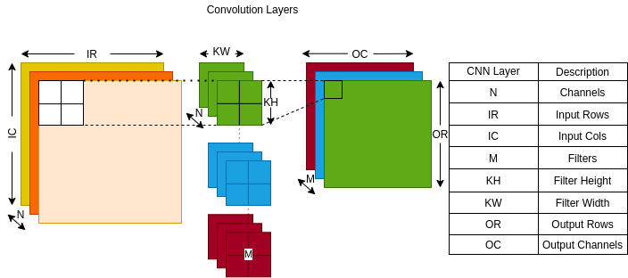

# DNN_HLS_Accelerator
This repository contains source code for CNN layers of AlexNet  using Xilinx HLS Vivado.
# Convolutional Neural Networks

# Pseudocode CNN

# Overview of the System

# Proposed CNN Hardware Implementation Results
| Conv Layers   | Execution Cycles  |
| ------------- |:-----------------:| 
| Layer_1       | 732050            |
| Layer_2       | 291600            | 
| Layer_3       | 389376            |
| Layer_4       | 292032            |
| Layer_5       | 146016            |
